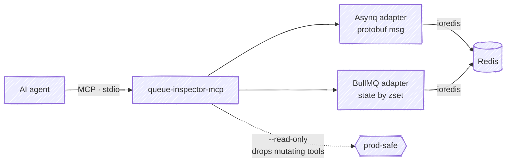
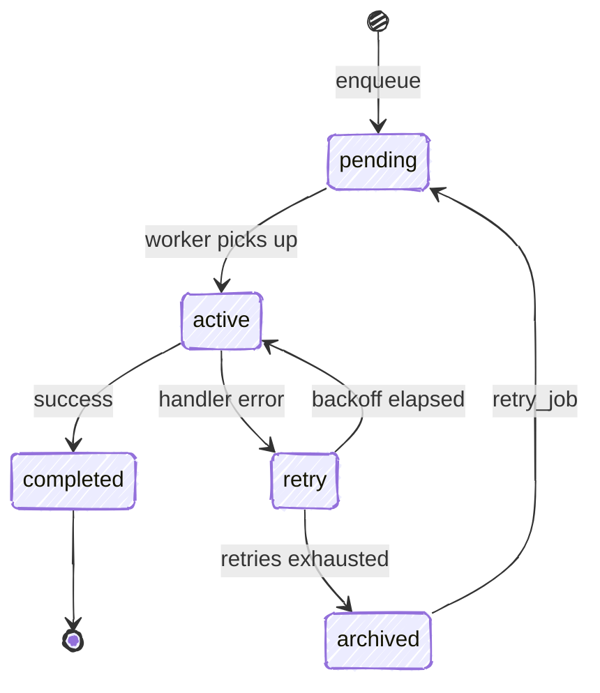

# queue-inspector-mcp

[](https://www.npmjs.com/package/queue-inspector-mcp) [](https://glama.ai/mcp/servers/Yusufihsangorgel/queue-inspector-mcp)

An MCP server that lets an agent inspect and operate Redis-backed job queues. It
speaks to two backends today, [Asynq](https://github.com/hibiken/asynq) (Go) and
[BullMQ](https://github.com/taskforcesh/bullmq) (Node), reporting per-state
counts, individual job detail, and moving jobs between states.

## Architecture



The server speaks MCP over stdio to the agent and talks to Redis through
per-backend adapters that understand each library's on-disk layout — Asynq's
protobuf task messages and BullMQ's state-by-membership sorted sets — instead of
treating Redis as a bag of keys.

## Why

When a queue misbehaves in production, the useful questions are about jobs, not
keys: how many tasks are stuck in retry, what error a specific job failed with,
how many attempts it has left, whether a dead job can be requeued. A plain Redis
MCP server can only show you keys and raw values; it does not know that an Asynq
task message is protobuf, that a BullMQ job's state is decided by which sorted
set it sits in, or how either library moves a job back to the front of the line.
This server encodes that knowledge so an agent can reason about queue state and
take safe, state-aware actions.

## Install

Requires Node.js 18 or newer and a reachable Redis.

```bash
npm install -g queue-inspector-mcp
# or run without installing:
npx queue-inspector-mcp
```

## Configure

The server talks MCP over stdio, so it works with any MCP client. Point your
client at the `queue-inspector-mcp` binary and set `REDIS_URL`.

Claude Desktop (`claude_desktop_config.json`):

```json
{
  "mcpServers": {
    "queues": {
      "command": "npx",
      "args": ["-y", "queue-inspector-mcp"],
      "env": { "REDIS_URL": "redis://localhost:6379" }
    }
  }
}
```

Claude Code (project `.mcp.json`, or `claude mcp add`):

```json
{
  "mcpServers": {
    "queues": {
      "command": "npx",
      "args": ["-y", "queue-inspector-mcp"],
      "env": { "REDIS_URL": "redis://localhost:6379", "QUEUE_INSPECTOR_READ_ONLY": "1" }
    }
  }
}
```

### Configuration

| Variable | Default | Purpose |
| --- | --- | --- |
| `REDIS_URL` | `redis://localhost:6379` | Redis connection string. Include a database number, e.g. `redis://localhost:6379/2`. |
| `ASYNQ_PREFIX` | `asynq` | Key prefix Asynq was configured with. |
| `BULL_PREFIX` | `bull` | Key prefix BullMQ was configured with. |
| `QUEUE_INSPECTOR_BACKENDS` | `asynq,bullmq` | Restrict which backends are scanned. |
| `QUEUE_INSPECTOR_READ_ONLY` | unset | Set to `1` (or pass `--read-only`) to omit the mutating tools. |

## Tools

| Tool | Mutating | Behavior |
| --- | --- | --- |
| `list_queues` | no | List every detected queue, tagged with its backend. |
| `queue_stats` | no | Count jobs per state for a queue, using the backend's own state names. |
| `list_jobs` | no | Page through jobs in one state; returns id, type, attempts, and a truncated last error. |
| `get_job` | no | Full detail for one job: payload, attempts, retry ceiling, last error, timestamps. |
| `retry_job` | yes | Move a failed or dead job back to pending/wait so it runs again. |
| `delete_job` | yes | Permanently delete a job. Active jobs are refused. |

When a queue name is unique across the enabled backends, the `backend` argument
is optional; the server resolves it. If the same name exists in both backends,
pass `backend` explicitly.

## Read-only mode

With `--read-only` or `QUEUE_INSPECTOR_READ_ONLY=1`, the server never registers
`retry_job` or `delete_job`. The mutating tools are absent from `tools/list`
entirely, so a client cannot call them by mistake. This is the recommended
configuration for pointing an agent at a production database.

## Backend state names

The two libraries model job lifecycles differently, so this server does not
invent a shared vocabulary. It reports each backend's own state names, and each
state maps to a specific Redis structure.

A job moves through these states over its lifetime (Asynq shown):



Asynq:

| State | Meaning | Redis structure |
| --- | --- | --- |
| `pending` | Ready to run, waiting for a worker | list `asynq:{q}:pending` |
| `active` | Currently being processed | list `asynq:{q}:active` |
| `scheduled` | Enqueued for a future time | zset `asynq:{q}:scheduled` |
| `retry` | Failed, waiting to be retried | zset `asynq:{q}:retry` |
| `archived` | Retries exhausted (the "dead" state) | zset `asynq:{q}:archived` |
| `completed` | Finished, kept for its retention window | zset `asynq:{q}:completed` |

BullMQ:

| State | Meaning | Redis structure |
| --- | --- | --- |
| `waiting` | Ready to run | list `bull:q:wait` |
| `active` | Currently being processed | list `bull:q:active` |
| `delayed` | Scheduled for a future time | zset `bull:q:delayed` |
| `prioritized` | Waiting, ordered by priority | zset `bull:q:prioritized` |
| `waiting-children` | Blocked on child jobs (flows) | zset `bull:q:waiting-children` |
| `paused` | Held while the queue is paused | list `bull:q:paused` |
| `completed` | Finished successfully | zset `bull:q:completed` |
| `failed` | Failed after exhausting attempts | zset `bull:q:failed` |

Asynq's `archived` is what most people mean by a "dead" job. `list_jobs` returns
Asynq's terminal sets in Redis (score) order and BullMQ's `completed`/`failed`
sets most-recent-first.

## What this doesn't do

- Only Asynq and BullMQ are supported. Sidekiq, Celery, RQ and others are not.
- No web UI. This is an MCP server for programmatic use; it is not a dashboard.
- No streaming or watch. Each tool call is a point-in-time read; there is no
  subscription to queue events.
- `retry_job` and `delete_job` faithfully replicate each library's own mechanism
  rather than reimplementing it. Retry runs Asynq's `Inspector.RunTask` script
  and BullMQ's `Job.retry` (`reprocessJob`) script; delete runs Asynq's
  `Inspector.DeleteTask` script and BullMQ's `Job.remove` (`removeJob`) script.
  As a result the semantics match the libraries: retrying a BullMQ job applies
  only to `failed`/`completed` jobs and does not reset `attemptsMade` (matching
  `Job.retry()`); neither backend can retry or delete an `active` job.
- `delete_job` removes a single BullMQ job and does not cascade into a flow's
  children.
- Asynq group aggregation (the `aggregating` state) is not surfaced in this
  release.

## License

MIT © Yusuf İhsan Görgel
