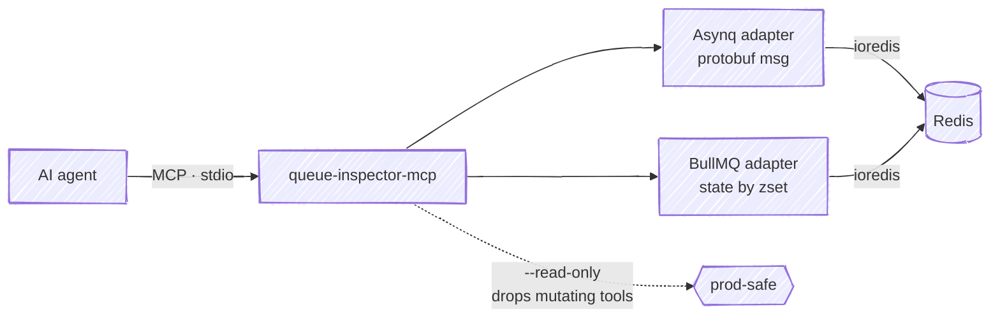
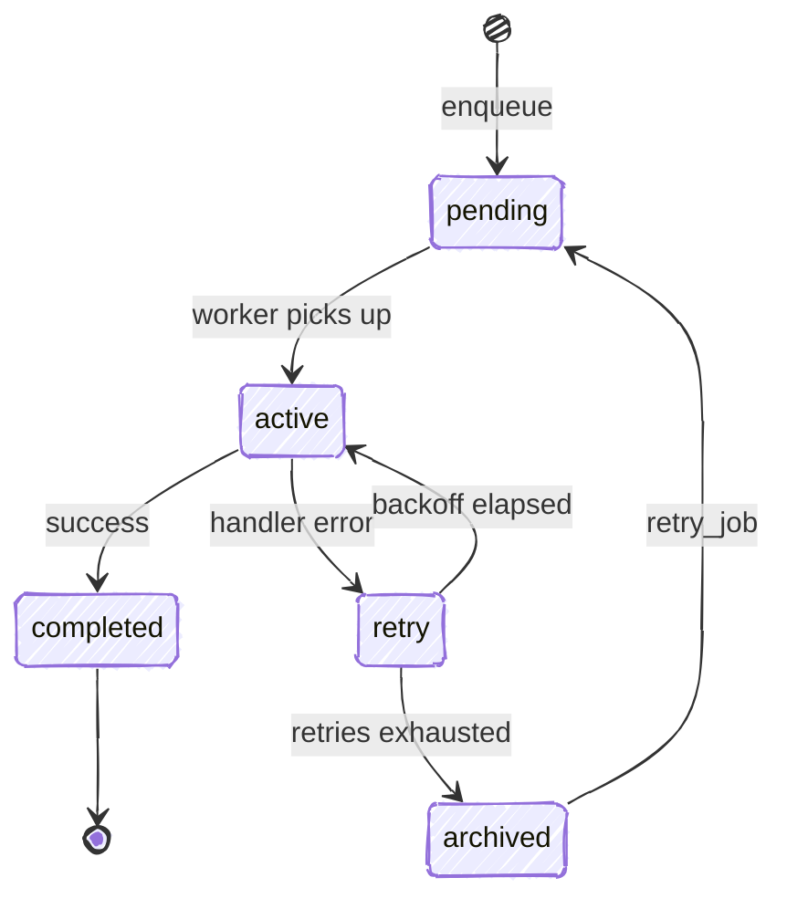

# queue-inspector-mcp

[](https://www.npmjs.com/package/queue-inspector-mcp) [](https://github.com/Yusufihsangorgel/queue-inspector-mcp/actions/workflows/ci.yml)

An MCP server that lets an agent inspect and operate Redis-backed job queues.
It speaks to two backends today, [Asynq](https://github.com/hibiken/asynq) (Go)
and [BullMQ](https://github.com/taskforcesh/bullmq) (Node): per-state counts,
individual job detail, and moving jobs between states — six tools over stdio,
with a `--read-only` mode that drops the mutating ones entirely.

When a queue misbehaves in production, the useful questions are about jobs, not
keys: how many tasks are stuck in retry, what error a specific job failed with,
whether a dead job can be requeued. A generic Redis MCP server shows you keys
and raw values; this one understands Asynq's protobuf task messages and
BullMQ's state structures, so an agent can answer those questions directly.

What this looks like from the agent side. The tool output below is recorded, not mocked: a local Redis seeded with real Asynq tasks, an SMTP relay down, and one delivery out of attempts.

```text
> smtp relay was down earlier, it's back now - did we strand anything in the default queue?

⏺ queues - queue_stats (MCP)(queue: "default")
  ⎿  { "queue": "default", "backend": "asynq", "states": { "pending": 0, "active": 0,
       "scheduled": 6, "retry": 38, "archived": 1, "completed": 57 } }

⏺ 38 tasks are stuck in retry and one is archived. Sampling the retries to see why.
⏺ queues - list_jobs (MCP)(queue: "default", state: "retry", limit: 3)
  ⎿  { …, "count": 3, "jobs": [
       { "id": "46c6ba86-…", "type": "email:deliver", …, "attempts": 5, "maxRetries": 25,
         "lastError": "dial tcp 127.0.0.1:2525: connect: connection refused" }, … ] }

⏺ Every sampled retry is email:deliver failing to reach the relay; those re-run on their own
  now that it's back. The archived task is out of attempts — it never will.
⏺ queues - list_jobs (MCP)(queue: "default", state: "archived", limit: 1)
  ⎿  { …, "count": 1, "jobs": [ { "id": "814cc556-04a8-4923-8de5-71a661c6063c", … } ] }
⏺ queues - get_job (MCP)(queue: "default", id: "814cc556-04a8-4923-8de5-71a661c6063c")
  ⎿  { …, "type": "email:deliver", "state": "archived", …, "attempts": 8, "maxRetries": 8,
       …, "fullError": "dial tcp 127.0.0.1:2525: connect: connection refused",
       "timestamps": { …, "lastFailedAt": "2026-07-10T14:01:40.000Z", … },
       "payload": "{\"to\":\"dana@example.test\",\"template\":\"receipt\"}", … }

⏺ A receipt email that burned all 8 attempts during the outage. Requeuing it.
⏺ queues - retry_job (MCP)(queue: "default", id: "814cc556-04a8-4923-8de5-71a661c6063c")
  ⎿  { "ok": true, "message": "asynq task 814cc556-04a8-4923-8de5-71a661c6063c moved to
       pending in queue \"default\"" }

⏺ queues - queue_stats (MCP)(queue: "default")
  ⎿  { "queue": "default", "backend": "asynq", "states": { "pending": 1, "active": 0,
       "scheduled": 6, "retry": 38, "archived": 0, "completed": 57 } }
⏺ The receipt is back in pending. The other 38 will re-run as their backoff timers come due.
```

> **Background:** I wrote up the design decisions behind this — why jobs, not keys, and the read-only posture — [on my blog](https://yusufihsangorgel.github.io/2026/07/08/queue-inspector-mcp.html).

## Architecture



The server speaks MCP over stdio to the agent and talks to Redis through
per-backend adapters that understand each library's Redis key layout — Asynq's
protobuf task messages and BullMQ's state-by-membership sorted sets — instead of
treating Redis as a bag of keys.

## Why an MCP server instead of the CLI

Asynq ships a CLI, and `redis-cli` can read anything. But wiring a CLI into an
agent means giving the agent a shell. The tools here return structured JSON the
model can reason over rather than aligned text to re-parse; they work in
clients that have no shell, like Claude Desktop; and read-only is enforced by
construction — under `--read-only` the mutating tools are not in `tools/list`
at all, which is a stronger guarantee than a confirmation prompt a model can
talk its way past.

## Install

Requires Node.js 18 or newer and a reachable Redis.

```bash
npm install -g queue-inspector-mcp
# or run without installing:
npx queue-inspector-mcp
```

## Configure

The server talks MCP over stdio, so it works with any MCP client. Point your
client at the `queue-inspector-mcp` binary and set `REDIS_URL`.

Claude Desktop (`claude_desktop_config.json`):

```json
{
  "mcpServers": {
    "queues": {
      "command": "npx",
      "args": ["-y", "queue-inspector-mcp"],
      "env": { "REDIS_URL": "redis://localhost:6379", "QUEUE_INSPECTOR_READ_ONLY": "1" }
    }
  }
}
```

Claude Code (project `.mcp.json`, or `claude mcp add`):

```json
{
  "mcpServers": {
    "queues": {
      "command": "npx",
      "args": ["-y", "queue-inspector-mcp"],
      "env": { "REDIS_URL": "redis://localhost:6379", "QUEUE_INSPECTOR_READ_ONLY": "1" }
    }
  }
}
```

Both examples are read-only. To enable `retry_job` and `delete_job`, remove
`QUEUE_INSPECTOR_READ_ONLY`.

### Configuration

| Variable | Default | Purpose |
| --- | --- | --- |
| `REDIS_URL` | `redis://localhost:6379` | Redis connection string. Include a database number, e.g. `redis://localhost:6379/2`. |
| `ASYNQ_PREFIX` | `asynq` | Key prefix Asynq was configured with. |
| `BULL_PREFIX` | `bull` | Key prefix BullMQ was configured with. |
| `QUEUE_INSPECTOR_BACKENDS` | `asynq,bullmq` | Restrict which backends are scanned. |
| `QUEUE_INSPECTOR_READ_ONLY` | unset | Set to `1` (or pass `--read-only`) to omit the mutating tools. |

## Tools

| Tool | Mutating | Behavior |
| --- | --- | --- |
| `list_queues` | no | List every detected queue, tagged with its backend. |
| `queue_stats` | no | Count jobs per state for a queue, using the backend's own state names. |
| `list_jobs` | no | Page through jobs in one state; returns id, type, attempts, and a truncated last error. |
| `get_job` | no | Full detail for one job: payload, attempts, retry ceiling, last error, timestamps. |
| `retry_job` | yes | Move a failed or dead job back to pending/wait so it runs again. |
| `delete_job` | yes | Permanently delete a job. Active jobs are refused. |

When a queue name is unique across the enabled backends, the `backend` argument
is optional; the server resolves it. If the same name exists in both backends,
pass `backend` explicitly.

## Read-only mode

With `--read-only` or `QUEUE_INSPECTOR_READ_ONLY=1`, the server never registers
`retry_job` or `delete_job`. The mutating tools are absent from `tools/list`
entirely, so a client cannot call them by mistake. This is the recommended
configuration for pointing an agent at a production Redis.

## Backend state names

The two libraries model job lifecycles differently, so this server does not
invent a shared vocabulary. It reports each backend's own state names, and each
state maps to a specific Redis structure.

A job moves through these states over its lifetime (Asynq shown):



Asynq:

| State | Meaning | Redis structure |
| --- | --- | --- |
| `pending` | Ready to run, waiting for a worker | list `asynq:{q}:pending` |
| `active` | Currently being processed | list `asynq:{q}:active` |
| `scheduled` | Enqueued for a future time | zset `asynq:{q}:scheduled` |
| `retry` | Failed, waiting to be retried | zset `asynq:{q}:retry` |
| `archived` | Retries exhausted (the "dead" state) | zset `asynq:{q}:archived` |
| `completed` | Finished, kept for its retention window | zset `asynq:{q}:completed` |

BullMQ:

| State | Meaning | Redis structure |
| --- | --- | --- |
| `waiting` | Ready to run | list `bull:q:wait` |
| `active` | Currently being processed | list `bull:q:active` |
| `delayed` | Scheduled for a future time | zset `bull:q:delayed` |
| `prioritized` | Waiting, ordered by priority | zset `bull:q:prioritized` |
| `waiting-children` | Blocked on child jobs (flows) | zset `bull:q:waiting-children` |
| `paused` | Held while the queue is paused | list `bull:q:paused` |
| `completed` | Finished successfully | zset `bull:q:completed` |
| `failed` | Failed after exhausting attempts | zset `bull:q:failed` |

Asynq's `archived` is what most people mean by a "dead" job. `list_jobs` returns
Asynq's terminal sets in Redis (score) order and BullMQ's `completed`/`failed`
sets most-recent-first.

## Compatibility

- Node.js 18 or newer; any MCP client that speaks stdio. CI runs the
  integration suite against Redis 7.
- `retry_job` and `delete_job` run each library's own Lua, vendored verbatim
  with provenance headers: `reprocessJob` and `removeJob` from BullMQ 5.79.3,
  `runTask` and `deleteTask` from Asynq v0.25.1.
- The integration tests read and mutate jobs produced by those same versions of
  the real libraries — the `verify/` producers lock BullMQ 5.79.3 and Asynq
  v0.25.1.
- BullMQ 4.x is untested: the adapter reads the v5 hash layout (attempts live
  in `atm`, where v4 used `attemptsMade`).

## What this doesn't do

- Only Asynq and BullMQ are supported. Sidekiq, Celery, RQ and others are not.
- No web UI. This is an MCP server for programmatic use; it is not a dashboard.
- No streaming or watch. Each tool call is a point-in-time read; there is no
  subscription to queue events.
- `retry_job` and `delete_job` faithfully replicate each library's own mechanism
  rather than reimplementing it. Retry runs Asynq's `Inspector.RunTask` script
  and BullMQ's `Job.retry` (`reprocessJob`) script; delete runs Asynq's
  `Inspector.DeleteTask` script and BullMQ's `Job.remove` (`removeJob`) script.
  As a result the semantics match the libraries: retrying a BullMQ job applies
  only to `failed`/`completed` jobs and does not reset `attemptsMade` (matching
  `Job.retry()`); neither backend can retry or delete an `active` job.
- `delete_job` removes a single BullMQ job and does not cascade into a flow's
  children.
- Asynq group aggregation (the `aggregating` state) is not surfaced in this
  release.

## Alternatives

- [bullmq-mcp](https://github.com/adamhancock/bullmq-mcp) — MCP server for
  BullMQ only; no read-only mode.
- [Workbench](https://github.com/pontusab/workbench) — a BullMQ dashboard whose
  MCP support is an HTTP proxy into a running Workbench instance. If you are
  BullMQ-only and want a UI, it is the better choice.
- [Asynqmon](https://github.com/hibiken/asynqmon) — Asynq's web dashboard, not
  an MCP server; no commits since May 2024.
- [mcp-redis](https://github.com/redis/mcp-redis) — the official Redis MCP
  server; operates on keys and values, not jobs.

As of this writing there is no other MCP server that speaks Asynq — a
13.5k-star library whose dashboard has been dormant since 2024 — and none that
reads both wire formats from one process.

## License

MIT © Yusuf İhsan Görgel
